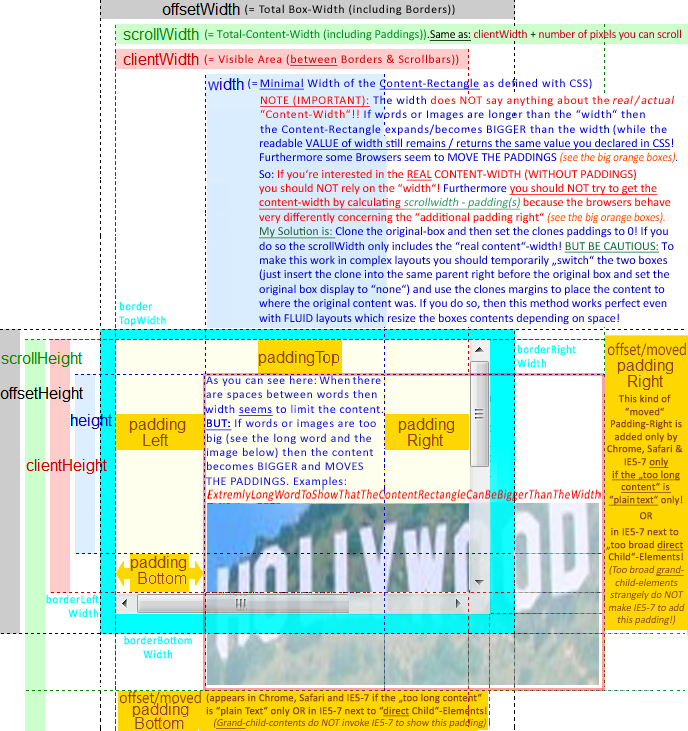
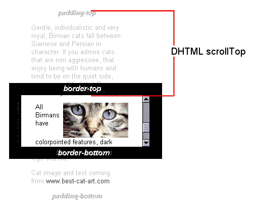

# 游戏直播 WEB 站, 客户端 -- 概要设计

# >  mada by chengda   mada502@126.com  马成达

QQ: 502312949


B/S架构的系统多使用HTTP协议，HTTP协议的特点：

1. 无状态协议
2. 用于通过 Internet 发送请求消息和响应消息
3. 使用端口接收和发送消息，默认为80端口

底层通信还是使用Socket完成。

HTTP协议决定了服务器与客户端之间的连接方式，无法直接实现消息推送,一些变相的解决办法：

双向通信与消息推送

[Web 通信 之 长连接、长轮询（long polling）](http://www.cnblogs.com/hoojo/p/longPolling_comet_jquery_iframe_ajax.html)

**轮询**：客户端定时向服务器发送Ajax请求，服务器接到请求后马上返回响应信息并关闭连接。

    优点：后端程序编写比较容易。
    缺点：请求中有大半是无用，浪费带宽和服务器资源。
    实例：适于小型应用。


**长轮询(long-polling)**：客户端向服务器发送Ajax请求，服务器接到请求后hold住连接，直到有新消息才返回响应信息并关闭连接，客户端处理完响应信息后再向服务器发送新的请求。

    优点：在无消息的情况下不会频繁的请求，耗费资源小。 
    缺点：服务器hold连接会消耗资源，返回数据顺序无保证，难于管理维护。 
    实例：WebQQ、Hi网页版、Facebook IM。

**长连接**：在页面里嵌入一个隐蔵iframe，将这个隐蔵iframe的src属性设为对一个长连接的请求或是采用xhr请求，服务器端就能源源不断地往客户端输入数据。 

    优点：消息即时到达，不发无用请求；管理起来也相对方便。 
    缺点：服务器维护一个长连接会增加开销。 
    实例：Gmail聊天

**Flash Socket**：在页面中内嵌入一个使用了Socket类的 Flash 程序JavaScript通过调用此Flash程序提供的Socket接口与服务器端的Socket接口进行通信，JavaScript在收到服务器端传送的信息后控制页面的显示。 

    优点：实现真正的即时通信，而不是伪即时。 
    缺点：客户端必须安装Flash插件；非HTTP协议，无法自动穿越防火墙。 
    实例：网络互动游戏。

**Websocket**: WebSocket是HTML5开始提供的一种浏览器与服务器间进行全双工通讯的网络技术。依靠这种技术可以实现客户端和服务器端的长连接，双向实时通信。

	优点:事件驱动,异步,使用ws或者wss协议的客户端socket,能够实现真正意义上的推送功能.
    缺点：少部分浏览器不支持，浏览器支持的程度与方式有区别。
	实例：视频直播弹幕。


# Websocket

[websocket api](https://developer.mozilla.org/en-US/docs/Web/API/WebSocket)

[websocket api 中文](https://developer.mozilla.org/zh-CN/docs/Web/API/WebSocket)

```js
// Create WebSocket connection.
const socket = new WebSocket('ws://localhost:8080');

// Connection opened
socket.addEventListener('open', function (event) {
    socket.send('Hello Server!');
});

// Listen for messages
socket.addEventListener('message', function (event) {
    console.log('Message from server ', event.data);
});
```

浏览器支持性


## socket.io

技术相关网址

[socket.io 官网](https://socket.io/)

[socket.io github](https://github.com/socketio/socket.io)

[socket.io get started demo](https://socket.io/get-started/chat/)

[socket.io 服务端 api](https://github.com/socketio/socket.io/blob/master/docs/API.md)

[socket.io 客户端 api](https://github.com/socketio/socket.io-client/blob/master/docs/API.md)

>**With websocket transport only**
>By default, a long-polling connection is established first, then upgraded to "better" transports (like WebSocket). If you like to live dangerously, this part can be skipped:

## Hello socket.io

服务端：基于Nodejs，express. （如果使用Node.js做后台，建议使用 koa3 搭建服务）

```js
let io = require('socket.io')(http)
let express = require('express')
let app = express();
let http = require('http').Server(app)

io.on('connection', function(socket) {
    console.log('a user connected')

    socket.on('chat message', function(msg) {
        console.log('message: ' + msg);
        io.emit('chat message', msg);
    });
})
```

客户端：

    1. demo中客户端返回结果是字符串，
    2. 真实的环境根据数据结构作解析处理，并根据解析结果，生成弹幕,消息，礼物等效果。
    3. 制作弹幕渲染效果库,根据消息类型，匹配效果。

```js
// 建立socket连接
var socket = io('http://localhost', {
	transports: ['websocket']
});

socket.on('chat message', function(r) {
    buildDamoo(r)
    buildMessage(r)
})
```

客户端 提交消息：

```js
socket.emit('chat message', message)
```

使用自定义路径:

```js
const socket = io('http://localhost', {
  path: '/myownpath'
});

// server-side
const io = require('socket.io')({
  path: '/myownpath'
});
```

## 权限控制，超级管理员。

使用查询字符串:

```js
const socket = io('http://localhost?token=abc');

// server-side
const io = require('socket.io')();

// middleware
io.use((socket, next) => {
  let token = socket.handshake.query.token;
  if (isValid(token)) {
    return next();
  }
  return next(new Error('authentication error'));
});

io.on('connection', (socket) => {
  let token = socket.handshake.query.token;
  // ...
});
```


~~## 性能优化~~

### 自定义 parser

>The default parser promotes compatibility (support for Blob, File, binary check) at the expense of performance. A custom parser can be provided to match the needs of your application.

[demo](https://github.com/socketio/socket.io/tree/master/examples/custom-parsers)

### 一次发送多条消息!

~~### web workers~~

>Web Worker为Web内容在后台线程中运行脚本提供了一种简单的方法。线程可以执行任务而不干扰用户界面。此外，他们可以使用XMLHttpRequest执行 I/O  (尽管responseXML和通道属性总是为空)。一旦创建， 一个worker 可以将消息发送到创建它的JavaScript代码, 通过将消息发布到该代码指定的事件处理程序 (反之亦然)。本文提供了有关使用Web Worker的详细介绍。

[web workers 详情](https://developer.mozilla.org/zh-CN/docs/Web/API/Web_Workers_API/Using_web_workers)

~~### WebAssembly~~

[WebAssembly.js](https://developer.mozilla.org/zh-CN/docs/Web/JavaScript/Reference/Global_Objects/WebAssembly)


~~### 健壮性~~

高并发实时弹幕是一种互动的体验。对于互动来说，考虑最多的地方就是：高稳定性、高可用性以及低延迟这三个方面。

    高稳定性，为了保证互动的实时性，所以要求连接状态稳定；

    高可用性，相当于提供一种备用方案，比如，互动时如果一台机器挂了，此时必须保证可以和另外一台机器连接，这样就从侧面解决了，用户连接不中断的问题；

    低延迟，弹幕的延迟周期控制在1秒以内，响应是比较快的，所以可以满足互动的需求。


[bilibili 高并发实时弹幕系统的实现](http://blog.csdn.net/zhiboshequ/article/details/68489960)

未完待续。。。


# 网页聊天功能

## 简单的 websocket 接口
```js
// 建立websocket连接
var socket = io('http://localhost');
```

## 接受服务端发送过来的数据，并构建消息列表

```js
socket.on('chat message', function(r) {
	// 构建弹幕
    buildDamoo(r)
    // 构建消息列表
    buildMessage(r)
})
```

注意:

1. 前端界面不断添加后台发送的消息，并删除超过限制的旧消息。
2. 最新消息显示在消息模块底部，默认情况保持滚动条在最底部。
3. 用户鼠标向上翻滚查阅历史消息，新消息的构建不得影响用户阅读位置。
4. 用户查阅历史消息时，有新消息时，提示消息条数，并设置引导按钮。
5. 设置用户查看历史消息最大值，超过最大值，强制消息列表滚动到最新位置，并初始化引导按钮。
6. 用户提交消息后，焦点在输入框内，用户按下向上按钮，显示用户历史输入记录。并可再次发送。
7. 登录相关。
8. 计算消息盒子滚动位置。

补充: 关于 盒模型， 原生 javascript 布局，位置计算。

[详细介绍](https://gitee.com/ReDreamport/StudyNotes/blob/master/Web/FinalWeb/Final%E5%B8%83%E5%B1%80-JS.md)



[offsetHeight](https://developer.mozilla.org/zh-CN/docs/Web/API/HTMLElement/offsetHeight)

[scrollHeight](https://developer.mozilla.org/zh-CN/docs/Web/API/Element/scrollHeight)

[scrollTop](https://developer.mozilla.org/zh-CN/docs/Web/API/Element/scrollTop)



## 用户发言

### demo

```js
// 用户发弹幕
var $form = $('.form-user-message')
var $btnSubmit = $form.find('.btn-submit')
var $text = $form.find('input')

$text.on('keyup', function(e) {
    if (e.keyCode && e.keyCode == 13) {
        var message = $text.val()
        if (!message) {
            return
        }
        sendMessage(message)
    }
})

$btnSubmit.on('click', function() {
    var message = $text.val()
    if (!message) {
        return
    }
    sendMessage(message)
})

function sendMessage(message) {
    socket.emit('chat message', message)
    $text.val('')
}
```

### 立即显示自己的发言。

TODO

### 发言缓存

1. 连续3次相同发言，前端先行判断（减少服务器压力），并提示“请不要重复发言”，无法发送成功。

### 敏感词本地限制

添加本地敏感词库。


## 响应式设计

rem
flex

## 移动端网页设计开发


# 弹幕功能

使用 **canvas** 遮罩在视频表面，
在弹幕层使用 css `pointer-events: none` 去除弹幕层的鼠标事件，用户点击事件会在弹幕下方的视频上触发。

使用轻量级 Damoo 插件，快速灵活制作弹幕
[Damoo](https://github.com/jamesliu96/Damoo)

[CanvasBarrage 使用canvas实现和HTML5 video交互的弹幕效果](http://www.zhangxinxu.com/wordpress/2017/09/html5-canvas-video-barrage/)

Notes: 挑战，付费弹幕

1. 自己写 canvas 弹幕插件，方便扩展。
~~2. 完成自定义 canvas 弹幕插件管理器，通过界面按钮设置，自动生成 弹幕插件。功能包括弹幕速度，弹幕颜色，弹幕文字大小等，方便后期维护，同时，可以为后期的送礼物弹幕提供编辑界面，生成礼物动画。~~
~~3. 通过 AE 生成礼物动画，嵌入html。可能会用到一些动画库，如 createjs，snap.js。(当然 也可以使用 div + css3 实现高级动画，效果不会差，但是性能有瓶颈。canvas具有更好的适应性, 但对制作动画的要求比较高，最好的方式是借助工具生成，也方便维护修改。)~~


弹幕 Dom:

```jade
.section.section-video
    .video
        h2 我是视频~

    #dm-main
        #dm-screen
```

初始化弹幕：

```js
var damoo = new Damoo('dm-screen', 'dm-canvas', 20, 'Helvetica');
damoo.play();

socket.on('chat message', function(r) {
    damoo.emit({ text: r, color: colors[Math.floor(Math.random() * colors.length)] })
    $messageContent.append(T.message({ list: [r] }))
    $messageContainer.scrollTop(10000)
})
```

TODO:

1. 视频开始播放之后，再开启弹幕
2. 弹幕开关
3. 特殊弹幕处理（送礼，vip，自定义弹幕）
4. 弹幕透明度，显示位置，字体大小，是否支持自定义颜色等


## 弹幕扩展

# 遗留问题

## 始终保持自己能够看到自己发的消息
TODO

## 当前在线人数

真实用户|遮羞用户

## 敏感词本地限制

## 重复发言限制

## 重播视频的弹幕处理


# 框架介绍

## jQuery + socket.io, Nodejs + koa, gulp+jade+stylus

### **gulp:**自动化构建工具

主要作用：

1. 自动编译代码（jade->html,stylus->css）
2. 压缩代码，去重。
3. autoprefixer 自动添加浏览器内核前缀.
4. 根据js，css文件编号自动生成序列号后缀，方便版本管理,避免不必要的缓存影响.
5. 合并css，js文件。
6. 自动生成web服务器，并根据文件改变，自动刷新页面。
7. 组件化管理，方便团队协作。

### **Jade**
模板公用。include extend mixins

### **Stylus**

> 富有表现力的、动态的、健壮的CSS

css 变量，运算符，循环，方法等。

构建 css 设计模式：

```stylus
abs-left($left = 0)
    position absolute
    left $left
    top 0
    right auto
    bottom auto

abs-right($right = 0)
    position absolute
    left auto
    right $right
    top 0
    bottom auto

// 拉伸 铺满父容器
fixed-stretch()
    -webkit-overflow-scroll:touch
    position fixed
    left 0
    top 0
    right 0
    bottom 0

    width 100%
    height 100%

// 容器高宽与图片尺寸一致
img-box($path)
    $path = img-path($path)
    width px(image-size($path)[0])
    height px(image-size($path)[1])

// px to rem
px($px)
    return ($px/40)rem
```

使用：

```stylus
$form-height = px(58)
.btn-show-latest-message
    abs-left 50%
    top auto
    bottom $form-height + px(10)
```

## (Vue.js, vue-cli, vue-router) + webpack + jade + stylus

[Vue.js 技术文档](https://cn.vuejs.org/v2/guide/)
[Vue.js v2 api](https://vuejs.org/v2/api/#Vue-component)


>Vue.js (读音 /vjuː/，类似于 view) 是一套构建用户界面的渐进式框架。与其他重量级框架不同的是，Vue 采用自底向上增量开发的设计。Vue 的核心库只关注视图层，它不仅易于上手，还便于与第三方库或既有项目整合。另一方面，当与单文件组件和 Vue 生态系统支持的库结合使用时，Vue 也完全能够为复杂的单页应用程序提供驱动。

## 前端路由


前端的路由和后端的路由在实现技术上不一样，但是原理都是一样的。在 HTML5 的 history API 出现之前，前端的路由都是通过 hash 来实现的，hash 能兼容低版本的浏览器。如果我们把上面例子中提到的 3 个页面用 hash 来实现的话，它的 URI 规则中需要带上 #。

```
1 http://10.0.0.1/
2 http://10.0.0.1/#/about
3 http://10.0.0.1/#/concat
```

Web 服务并不会解析 hash，也就是说 # 后的内容 Web 服务都会自动忽略，但是 JavaScript 是可以通过 window.location.hash 读取到的，读取到路径加以解析之后就可以响应不同路径的逻辑处理。
history 是 HTML5 才有的新 API，可以用来操作浏览器的 session history。基于 history 来实现的路由可以和最初的例子中提到的路径规则一样。

```
1 http://10.0.0.1/
2 http://10.0.0.1/about
3 http://10.0.0.1/concat
```


### page.js
[http://visionmedia.github.io/page.js/](http://visionmedia.github.io/page.js/)


### Vue.js 开发使用 Vue-router2

[vue-router 2](https://router.vuejs.org/zh-cn/index.html)


